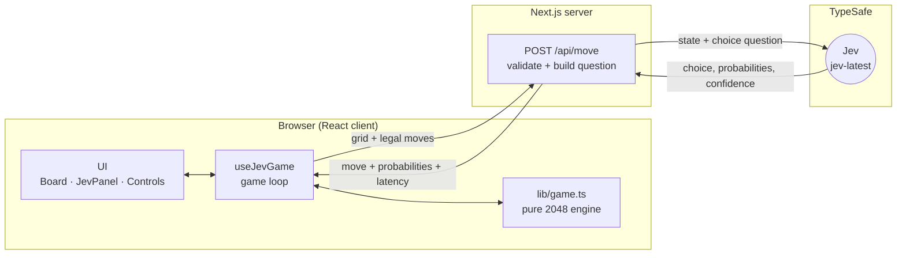
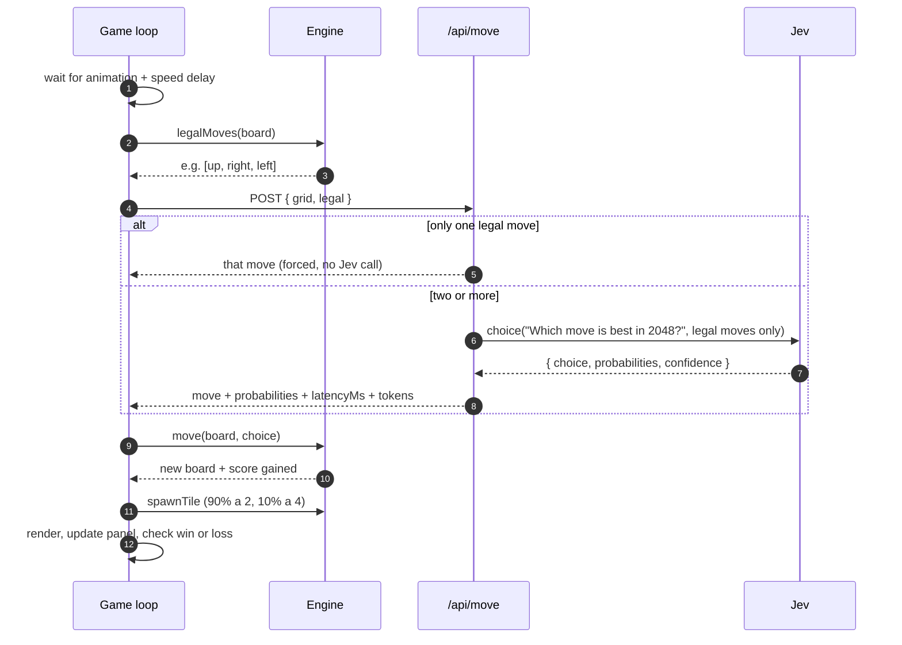
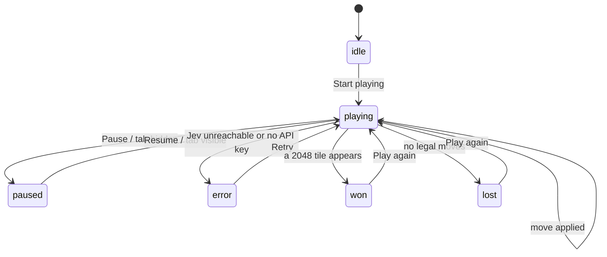
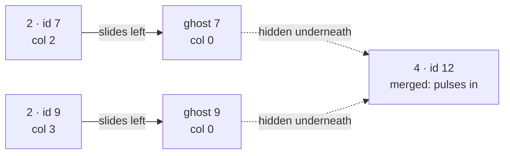

# Jev plays 2048

A live demo of TypeSafe's **Jev**, a System One model, playing 2048 on its own.

Jev doesn't generate text. It returns **typed answers with calibrated probabilities**, fast
enough (about 100 ms target) to sit inside a game loop. Each move in this demo is one Jev
`choice` over the raw board:

> *"Which move is best in 2048?"*: `up` · `right` · `down` · `left`

There's no search tree, no heuristics and no strategy hints. What you see on screen is Jev's
own judgment, with its probability for every direction.

---

## Run it

```bash
cp .env.local.example .env.local   # add your TYPESAFE_API_KEY
npm install
npm run dev                        # http://localhost:3000
npm test                           # game-engine unit tests
```

Click **Start playing** and watch.

---

## Architecture

The browser owns the game and the animation. A small server route owns the API key and
talks to Jev. The key never reaches the client.



| Piece | File | Responsibility |
| --- | --- | --- |
| Game engine | `lib/game.ts` | Pure, deterministic 2048 rules: sliding, merging, spawning, legal moves, win/loss |
| Game loop | `hooks/useJevGame.ts` | Runs the think, move, animate, wait cycle; handles pause, errors and restarts |
| Jev route | `app/api/move/route.ts` | Validates input, asks Jev, and returns a typed response with timing |
| UI | `components/*` | Board, probability panel, speed controls, overlays |

---

## One turn, end to end



### What Jev actually receives

```jsonc
// state
{ "board": [[2, null, null, 4], [null, 8, null, null], [null, null, 2, null], [16, null, null, null]] }

// question: one Choice, with only the legal directions as options
{ "move": { "type": "choice",
            "instructions": "Which move is best in 2048?",
            "criteria": { "up": null, "right": null, "left": null } } }
```

### What comes back

```jsonc
{ "move": { "choice": "left",
            "probabilities": { "up": 0.18, "right": 0.11, "left": 0.71 },
            "confidence": 0.64 } }
```

Directions that wouldn't change the board are **never offered**, so Jev can't stall the game.
Every probability you see in the panel comes straight from this response.

---

## The game loop as a state machine



The loop is **strictly sequential**: one request at a time, and the next one starts only after
the previous move has animated. Every step runs inside a React effect with an `AbortController`,
so pausing, restarting, hiding the tab or unmounting cancels any request still in flight. A
stale answer can never land on a newer board.

---

## Speed modes

Per move, the loop waits for the animation to finish plus an extra pause, then asks Jev:

```mermaid
gantt
    title Time per move (Jev latency not shown)
    dateFormat x
    axisFormat %L ms

    section Watch
    animation      :a1, 0, 260
    reading pause  :a2, after a1, 1200

    section Normal
    animation      :b1, 0, 260
    reading pause  :b2, after b1, 300

    section Max
    animation      :c1, 0, 120
```



| Mode | Best for |
| --- | --- |
| **Watch** | Presenting: time to read the probability bars |
| **Normal** | The default, like a quick human player |
| **Max** | Showing raw speed: as fast as Jev answers, with shorter slide animations |

---

## How the tile animations work

Every tile keeps a **stable id** from the engine, so React moves the same DOM element and CSS
slides it to its new cell. When two tiles merge, the engine keeps both originals for one frame
as **ghosts** that slide into the target cell underneath, while a brand-new merged tile pops in
on top once the slide ends.



Motion follows Emil Kowalski's design-engineering guidelines:

- Only `transform` and `opacity` animate, so everything stays GPU-composited.
- Custom easing curves: a strong ease-out for things entering, ease-in-out for sliding.
- Nothing scales from `0`. New tiles start at `0.88` and fade in.
- The probability bars use interruptible CSS transitions (`scaleX`), so rapid updates retarget smoothly.
- With `prefers-reduced-motion`, the slides and pops become simple fades.

---

## Why a "bare" question?

Jev is built for fast, focused judgments, and its docs say plainly that it isn't a calculator
and is weaker on numeric grids. We chose the purest framing on purpose: raw board in, one
choice out. Jev won't always reach 2048. The demo shows honestly what a single typed judgment
does on a problem like this, including where its confidence spreads out.

Want to push it further? The TypeSafe docs describe patterns such as
[composite scoring](https://docs.typesafe.ai/patterns/composite-scoring) and
[speculative fan-out](https://docs.typesafe.ai/patterns/fan-out). In those, code simulates
each move and Jev judges plain-language descriptions of the outcomes. That's a natural next
experiment.

---

## Project layout

```
app/
  api/move/route.ts   server route that calls Jev
  page.tsx            page layout
  layout.tsx          fonts and metadata
  globals.css         design tokens, tiles, motion
  icon.png            favicon
components/
  Board.tsx           grid and animated tiles
  JevPanel.tsx        probability bars, confidence ring, stats
  Controls.tsx        score, speed selector, pause
  Overlays.tsx        start, win/lose, error toast
hooks/
  useJevGame.ts       game-loop state machine
lib/
  game.ts             pure 2048 engine
  game.test.ts        engine tests (vitest)
  api.ts              shared response types
```
